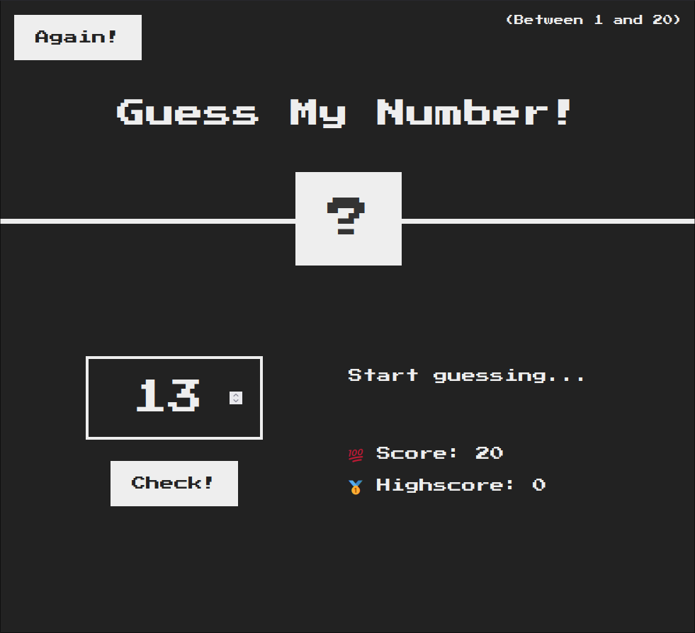
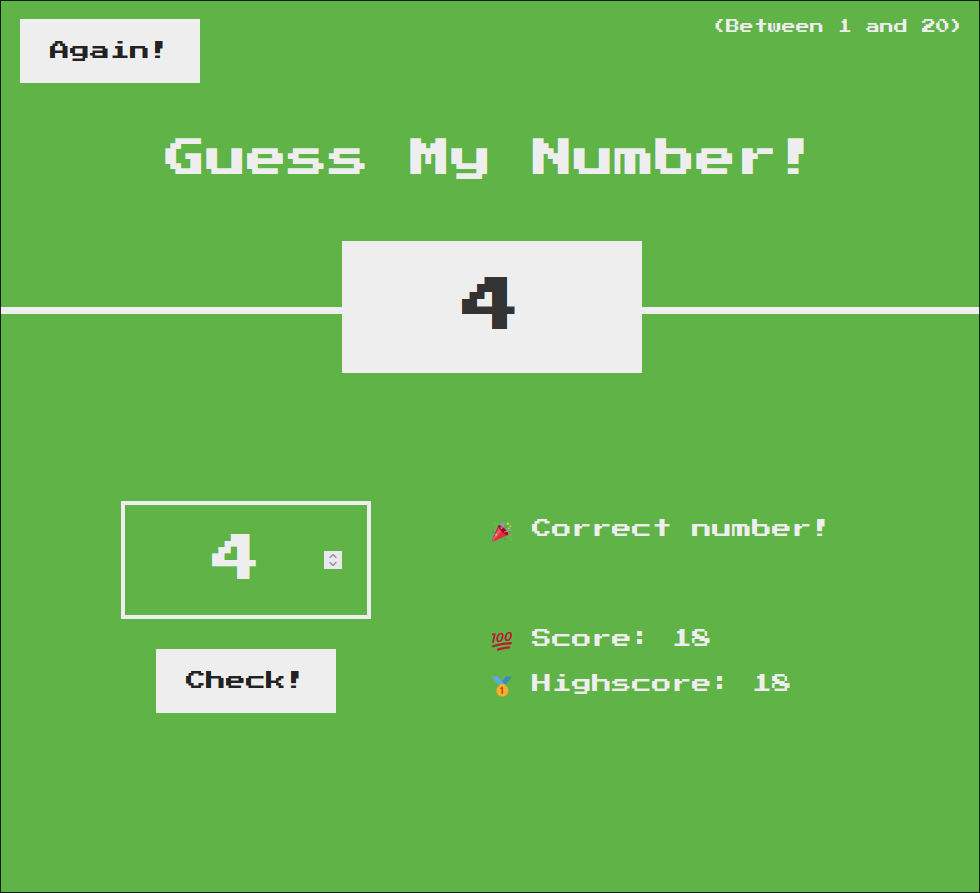

# Guess My Number!

A simple one-page project on pure javascript.

## Rules:

- You have to guess a number between 1 and 20.
- You have three tries.
- You have to make the fewest number of mistakes to get the highest score!

## Showcase:

- **Main page**:
  

- **Winning page**:
  
